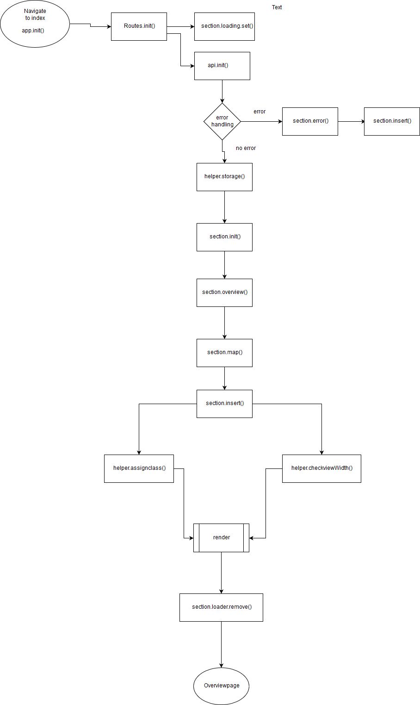

# Web-App-from-Scratch

*This Singe page web application enable you to keep track of the lastest price of the top 100 (coinmarketcap) cryptocurrencies*

#Table of Content
- [Getting started](##Getting-started)
- [Wafs in general](##Singe-page-web-app-in-general)
- [Inspiration](##Inspiration)

## Getting started
1. Clone the repo
2. Change directory to ``app``
3. Install all dependencies with ``npm install``
4. You're ready to go!

# Actor & Flow diagram
*To better understand how the application works, an actor and flow diagram is created to give an overview wich function is used in the application*/

## Actor diagram

## Flow diagram

## Single page web app in general
*A single-page application (SPA) is an app that works inside a browser and does not require page reloading during use. You are using this type of applications every day. These are, for instance: Gmail, Google Maps, Facebook or GitHub.*

### Pro
- SPA is fast, as most resources (HTML+CSS+Scripts) are only loaded once throughout the lifespan of application. Only data is transmitted back and forth.

- SPA can cache any local storage effectively. An application sends only one request, store all data, then it can use this data and works even offline.

- The development is simplified and streamlined. There is no need to write code to render pages on the server. It is much easier to get started because you can usually kick off development from a file file://URI, without using any server at all.

### Con
- It is slow to download because heavy client frameworks are required to be loaded to the client.

- It requires JavaScript to be present and enabled. If any user disables JavaScript in his or her browser, it won’t be possible to present application and its actions in a correct way.

Neoteric ('Single-page application vs. multiple-page application'), taken from: https://medium.com/@NeotericEU/single-page-application-vs-multiple-page-application-2591588efe58

## Frameworks in general

### Pro
- A good programmer know how to get the job done well and fast. If you don't need to write code from scratch why should you? Frameworks are just tools, tools that any profession has to work better. 

- Efficiency is also about lines of code.

### Con

- If you don't know the underlying principles of the web, you'll eventually hit a wall thanks to the evolution of the language itself and the constant arrival of new frameworks.

- People start using frameworks and libraries without even thinking about how to solve the problem without them. Often, a solution in VanillaJS is very easy, but people are so used to work with frameworks and libraries that they load a lot of extra code to do very simple things.

Francois-Xavier P. Darveau ('Yes, You Should Learn Vanilla JavaScript Before Fancy JS Frameworks'), taken from: https://snipcart.com/blog/learn-vanilla-javascript-before-using-js-frameworks

Marco Alka ('Vanilla JavaScript vs. Frameworks & Libraries sFinding a good balance'), taken from : https://hashnode.com/post/vanilla-javascript-vs-frameworks-and-libraries-finding-a-good-balance-civ1zfus90pphdc53q8vtakz5

## Inspiration
*The first thing I did was looking for inspiration and and good examples of single page application.*

### district0x
url: https://district0x.io/

District0x makes great use of typography, color, and scroll animation. When viewing the site on mobile, the site is still great to use. The animation that is displayed still plays at around 60fps. And there is alot of whitespaces that gives the content more air to display itself.\

### Kollergorna
url: https://radar.kollegorna.se/

Kollergorna is a beautifull site that doens't use a traditional layout. Also they give the user an option to view their content in a different layout. Lastly the loadying of the content in insanely fast. 

## Term
### Promise
A Promise is an object representing the eventual completion or failure of an asynchronous operation. Since most people are consumers of already-created promises, this guide will explain consumption of returned promises before explaining how to create them.

Essentially, a promise is a returned object to which you attach callbacks, instead of passing callbacks into a function.

Cross-Origin-aanvraag geblokkeerd: de Same Origin Policy staat het lezen van de externe bron op https://api.coinmarketcap.com/v1/ticker/ niet toe. (Reden: CORS-header ‘Access-Control-Allow-Origin’ ontbreekt).

### Resource
- https://developer.mozilla.org/nl/docs/Web/API/XMLHttpRequest/Using_XMLHttpRequest
- https://developer.mozilla.org/en-US/docs/Web/JavaScript/Reference/Statements/async_function
- https://developer.mozilla.org/en-US/docs/Web/HTTP/Headers/Access-Control-Allow-Origin
-https://developer.mozilla.org/en-US/docs/Web/HTTP/CORS
# To do
1. Create an issue for Leonie
2. Create an issue for Kevin
3. create responsive menu
4. Best practices
5. Manage routes en states
6. Get / Post data van/naar API
7. Data manipuleren
8. Data presenteren
9. Web Worker implementeren (extra)
10. Code review

